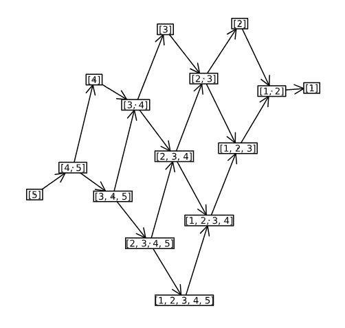

# GabrielQuiverOfEndRingG
This is a code to visualize Gabriel quiver of END(G), where G is all the direct sum of the non-iso interval modules. This code is the implementation of Proposition 6.8. of the paper  "EXACT STRUCTURES FOR PERSISTECE MODULES" by B. Blanchette, T. BrüStle, and E.J.Hanson.
See <a href="https://arxiv.org/abs/2308.01790">arXiv:2308.01790 </a>for more details.
 
For a quiver 1→2→3→4→5, we write End(G)'s irreducible morphism, where G is all the direct sums of non-iso interval modules. In this sprcial setting, the Gabriel quiver of End(G) is the same as path algebra of the quiver 1→2→3→4→5 up to opposite.  
 
Note that the picture below writes only irreducible morphisms of , so there is no information about some relations.
 <!-- Picture -->
  

    
    

    <small>
    </small>
<!-- end Picture -->
