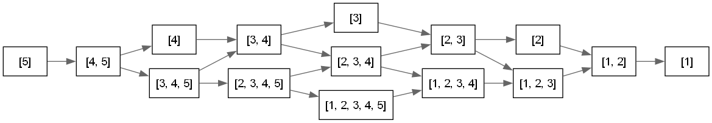

# GabrielQuiverOfEndRingG

This code is the implementation of Proposition 4.11 of the paper
"STABILIZATION OF THE SPREAD-GLOBAL DIMENSION" by BENJAMIN BLANCHETTE, JUSTIN DESROCHERS, ERIC J. HANSON, AND LUIS SCOCCOLA
<br>
see also "EXACT STRUCTURES FOR PERSISTECE MODULES" by B. Blanchette, T. BrüStle, and E.J.Hanson.   
See <a href="https://arxiv.org/abs/2506.01828(https://arxiv.org/pdf/2506.01828)">arXiv:2506.01828 </a> for more details. 
<br>
<br>
　For a quiver 1→2→3→4→5, we write End(G)'s irreducible morphism.
<br>
 <!-- Picture -->
  <div title="picture">
    
    </div>
<!-- end Picture -->
Note that the picture below writes only irreducible morphisms of End(G), so there is no information about some relations.

---

## How to reproduce the figure

The input to the code is a **poset matrix** (the transitive closure matrix):  
`P[i,j] = 1` if there is a directed path `i → … → j`, and `0` otherwise (with `P[i,i] = 1`).

```julia
A5 = [1 1 1 1 1;
      0 1 1 1 1;
      0 0 1 1 1;
      0 0 0 1 1;
      0 0 0 0 1]

Gquiver.output(A5, "A5")
